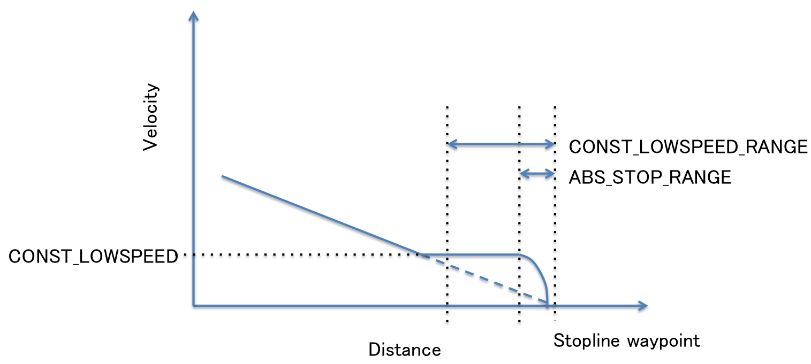

# Self Driving Car Capstone Project
The goal of this project is to use ROS code to integrate with Carla, Udacity's Self Driving Car. To get there our team utilized a simulator that works very similarly to Carla to drive on a simulated highway with traffic lights. The project then transitions into the real world and is tested on Carla in a closed track to mimick various conditions similar to a real public road environment.

[//]: # (Image References)

[image1]: /img/final-project-ros-graph-v2.png "ROS System"

### Team
| Name | Email |
| :------------------------------- |:------------------------------------|
| Krishan Patel (Team Leader)  | kspatel95@gmail.com |
| Tamás Kerecsen                    | kerecsen@gmail.com |
| Tomoya Matsumura               | tomoya.matsumura@gmail.com |
| György Blahut                        | fable3@gmail.com |

### To get Ros code started (Simulator)
```
1. cd Self-Driving-Car
2. ./run.sh
```
### If setup is needed for downloading required packages
``` 
./setup.sh
```
---

## ROS System

The ROS system utilized in the Simulator is intended to be modeled very similarly to the Udacity Self Driving Car. 
The architecture of the ROS nodes was defined in the project repository, but
some of the modules have not (or not fully) been implemented.
Our task was to develop these missing portions, including the modules listed below.  

![Final score][image1]

### Main Components of the project
---
#### Waypoint Updater

The simulated car as well as the self driving car are provided with 
waypoints that our software receives through the ROS System. The Waypoint Updater 
node is in charge of building a route with these waypoints, and continuously transferring
the next points to tell the car where to go. 
At startup, the car is given base waypoints for the entire route. 
Our code only looks at a portion of the waypoints that is immediately relevant to the car. 
It starts by finding the closest waypoint ahead of the car and 
LOOKAHEAD_WPS number of waypoints further ahead, then makes any adjustments 
needed based on traffic lights or obstacles.  
If obstacles or traffic lights are detected, a path is planned that slows
down ahead of the stop line or obstacle. 
Deceleration concept is as following picture. Once the vehicle detected the next traffic light as red, the target velocities for each waypoint are defined as linear deceleration till the stopline waypoint except the below condition.
- the calculated velocity is lower than CONST_LOWSPEED, set CONST_LOWSPEED as target speed
- distance to stopline waypoint within CONST_LOWSPEED_RANGE, set CONST_LOWSPEED as target speed.
- distance to stopline waypoint within ABS_STOP_RANGE, set SQRT deceleration to absolutely stop before the stopline.


#### Traffic Light Detection

The TLDetector node is responsible for receiving the camera image from an upward
facing camera, and identifying if there are red or green lights ahead of the car.
The node also receives a list of the traffic light locations and the corresponding 
stop lines, which makes this task a bit easier.
If a red light is identified, the node publishes a `traffic_waypoint` message,
informing other nodes (primarily the Waypoint Updater) of the potential
obstacle ahead.

The TLDetector uses a neural network to identify the traffic lights and their
color on the camera image. Selecting the type of neural network, and training it
 for the particular requirements of the project turned out to be a bit of a
  challenge. There are two very different scenarios where the visual
   classifier network has to function. One is the simulator, and the other
    one is the real world
test track, where Carla runs. The appearance of the background and the
 traffic light is very different in the two scenarios, so either two separate
  classifiers have to be developed for the two scenarios, or the one has to
   be very flexible with regards to the appearance of the lights and the
    background.  
    
In addition to this challenge, Carla runs a very old Tensorflow 1.3 and
 Python 2.7 environment, that rules out many off-the-shelf solutions
available in modern Keras and Python environments.

We tried the approaches below with more or less success to find the best compromise between
performance, recognition quality in the simulator and on the ROSbag recorded images
 from the test track, as well as compatibility with the environment.
 
##### Whole-image classifier
The first approach we tried was the one we perfected in the Behavioral
 Cloning section of the course: training a recognizer on entire pictures and
 hoping it learns how to distinguish the traffic light colors automatically. 
 We applied what we learned about Transfer Learning, took the MobileNet V1
 224x224 classifier (the only one available in this old version of Keras as
  a turn-key base classifier) and tried to train it on images captured from
   the simulator.

But first we needed an annotated image database that would allow training or
hand-tuning the recognizers. So we created a tool  (`src/trafficlight_capturer`) 
that runs as a ROS node, and combines the gound
truth information coming from the simulator in the `vehicle/traffic_lights`
ROS topic with the images coming from the simulator in the `/image_color`
topic and built a database of annotated images: images combined the traffic
light state. 

When traffic lights are calculated to be visible (and close enough) based on the
 pose of the car and that of the traffic light, the tool saves each incoming
  image to a folder structure that is compatible with the Keras
   ImageDataGenerator (using the traffic light state helpfully provided by the simulator).

A trainer python tool (`trainer/trainer.py`) takes these images and
 retrains the MobileNet V1 sample in Keras with the images as input.

The resulting classifier worked acceptably well, once it was close enough, it
 recognized the traffic light colors, but it was noisy and unpredictable when
  farther away from the lights. It obviously didn't work for the real-world
   scenario at all without further training. 
   
Although we probably could have fulfilled the project rubric with this
 classifier, we decided to move on an try to find a more robust and universal solution.
 
##### SSD-style classifer + secondary classifier
The next obvious way to solve the problem of traffic light detection is to
find an SSD-style one-shot classifier that is capable of finding the traffic
lights in the image, and combine it with a secondary CV-based or neural
network based subclassifier to identify the traffic light state (color). 
The secondary classifier is necessary because off-the-shelf pre-trained SSD
classifiers are typically trained on the Coco database, and that database
 doesn't label red, green and yellow light separately, they are all just
  labeled as "traffic lights".

Based on the literature, there are two obvious candidates for an SSD style
 classifier that can run at a high framerate in the constrained hardware
  environment of a car. One is MobileNet SSD, and the other is Yolo. There
   are multiple configurations available for each, and we selected
MobileNet SSD V1 224 with training data from the Mobile Zoo as one candidate
, and YoloV3-tiny-pnr as another one.  

First, we integrated MobileNet SSD into the ROS environment. We included it
 in the trafficlight_capture node, and outputted the detection results
  (colored rectangles overlaid on the camera image) into a new, `/image_recognized`
   ROS topic. This way we could observe how the model  was behaving using at
    real time with the help of `rqt_image_viewer`
 
After lowering the threshold detection confidence to 20%, the MobileNet SSD
 network was finding most of the traffic lights in the simulator, but it
  also found a lot of side-facing and back-facing traffic lights as well. 
  It also didn't do a whole lot of recognizing with the real-world images from the ROSbag. 

So after some research we identified the Yolo family as another potentially
 acceptable trade-off between speed and quality. The full-blown YoloV4 was
  too slow at least in the VM environment, but there was a very promising, 
  recently developed candidate, YoloV3-tiny-PRN, which has a very small 16MB parameter file and
    runs at 10+ fps even in CPU-only mode. (see https://github.com/WongKinYiu
    /PartialResidualNetworks and https://github.com/AlexeyAB/darknet).
     
Unfortunately Yolo natively runs under the darknet neural network development
 tool, not Tensorflow. There are Tensorflow ports of Yolo, but we didn't
  manage to get any of them working with the published weight files (we
   backported a couple to python 2.7 and tensorflow 1.3, but for some reason
   the way they were loading the weights
   - which involves a lot of bit shuffling and tensorflow surgery - failed in
    our environment). It would have been possible to train such a model from
     scratch, but it would have required more training hours than what we had
      available in the workspace.
      
So we looked at pulling in darknet, the original execution environment of
 Yolo, as a module into the python/ROS architecture we were building. We
  managed to get a darknet `.so` library built with `catkin-make`, and call the
   library from our python software, and were able to deeply test this option
    as well.  It worked better than MobileNet SSD did, but had the same
     essential shortcomings (extraneous bounding boxes on rear-facing and
      side-facing traffic lights, missed traffic lights, major difficulties
       with the parking lot scenario).

The secondary classifier works on small images, once the primary classifier identified the box of a traffic light.
There are 2 possible solutions, either try to use CV tools to classify, or train a separate neural network.
Since the problem at hand was very similar to the Traffic Sign Classifier project, we trained a LeNet network to do the job.
To prepare for real-life scenarios, we trained the network on 55,000 images from the LISA Traffic Light Dataset.
The trainer code is in trainer/Traffic_Light_Classifier.ipynb, the combination of MobileNet and the secondary network is in trainer/Combined.ipynb

While this is a very strong combination in real world situations, in the parking lot MobileNet couldn't reliably detect the traffic light, and when it did, the
secondary classifier had problems. Green light was classified yellow or red, due to the heavy yellow color from the frame.

There are 3 ROSbag files which we used for testing, using the first word of the filename they're called Just, Loop and Train.
The first 2 was promising, but the 3rd one had problems even on the pretrained MobileNet part.
Here's an annotated video of the "just_traffic_light" ROSbag: [fablenet_just.mp4](writeup_illustrations/fablenet_just.mp4)
     
Both MobileNet and Yolo, even in their maxed-out configurations reacted very-very
 poorly to the yellow colored traffic light used in the parking lot
 testing with Carla. Apparently the Coco dataset doesn't have yellow traffic
  lights, therefore the recognizers trained on this dataset have no clue what
   such a yellow object might be. This situation called for custom training...

##### Custom-trained SSD-style classifier 
The final approach we tried was to train an MobileNet SSD network on our
specific yellow real-world traffic light, and our simulated, but 
traditional-looking lights. And since we had to start from scratch, we decided to
separately train for each color, and get traffic light states with a one-shot 
process. So the hope was that we would end up with a classifier that can do 3
 different positive predictions (red, yellow and green light positions) and
  one negative prediction (no traffic lights visible).

First we checked if we could take advantage of transfer learning, and could
 re-train a full-blown MobileNet SSD model to our special requirements. This 
approach remained elusive, as it would have needed several days of training
 time on a high-end GPU.

Fortunately during this process we found this fantastic github repository: 
https://github.com/pierluigiferrari/ssd_keras 
Among other things, he describes a miniature "SSD7" architecture, that is
 trainable within the means of regular developers. It takes a 2-3 hours to fully
  train from scratch in the workspace with the K80 GPU, and 5-10 times that on
   a home PC, which is still reasonable.
   
Here is the architecture of the SSD7 network:

   
The next challenge was to obtain an augmented dataset which includes color
 information and bounding boxes for our two sets of traffic lights. We
  managed to generate some of this data using semi-automated methods (see
   details below), but we
   also had to do several hours of hand-labeling. Altogether we accumulated
  over 1600 labeled images, which was sufficient to get fairly robust training
   results. The performance of the model never reached 100%, but when
    averaging 2 out of 3 detections the results were practically perfect.   
 
The semi-automated annotation tool is in trainer/AutoAnnot.ipynb.
It uses the manually edited annot_hint.txt file, and the images from the training ROSbag file.
The numbers in the text file are the frame numbers, r/g/y is the color, which is the same for subsequent images, so only captured at changes.
The tool tries to extract a bounding box, but sometimes only half the traffic light is identified, or extra boxes would appear.
The text file is from manually checking all the images for complete boxes, and recording their numbers.
When there's no box at all, the image is skipped automatically, which helps entering ranges.
The detection algorithm on the LAB color model, which is good for identifing yellow. It's enhanched with CLAHE.
Sobel finds vertical edges. After tresholding, HoughTransformP finds the lines.
Lines are filtered so that they need to be mostly vertical, in pairs, and the resulting box width has to be 0.3 to 0.6 times the height.
The result can be seen in annotated video form: [traffic_lights_training_annot.mp4](writeup_illustrations/traffic_lights_training_annot1.mp4)

Here are some examples of how the network behaves on different datasets:

<div>
    <video width="99%" height="640" autoplay loop muted>
        <source src="writeup_illustrations/ssd7_fablemagic.mp4" type="video/mp4">
    </video>
</div>

[Parking lot](writeup_illustrations/ssd7_fablemagic.mp4) and
[Simulator](writeup_illustrations/ssd7_simulation.mp4)

There are 2 separate topics for image: image_color and image_raw.
The simulator only sends image_color, the Just and the Loop ROSbag files only had image_raw, the Train ROSbag had both.
The Traffic Light Detector subscribes for both topics. If both topics have messages at the same time, image_color has priority.
Ihe image_raw uses Bayer-encoded black and white image, which is converted to color using OpenCV.

To obtain the images from the ROSbag files, the messages are converted to text:
```
rostopic echo /image_raw -b traffic_light_training.bag > training_image_raw
```
The resulting text file is converted to RGB image list with the `trainer/raw2img.py` script.

Training was based on the distorted camera images, so undistorting images before prediction would be detrimental.

To confirm that traffic light detection works on real life images, we used the ROSbag playback while the simulator was running as well.
The car was "parked" before a traffic light in the simulator by manually crashing it into a tree. This was necessary to trigger the detection.
Camera feed was switched off in the simulator, the tl_detector node was working on the ROSbag images.

#### Drive By Wire Node

The DBW Node uses the data coming from the waypoint updater to know when to apply different commands to throttle, braking, and steering. By default the car is going to throttle till it hits the speed limit or the vehicle limit, as the waypoints require some steering or braking the car relies on updates from the twist_controller.py. The Twist Controller  utilizes a combination of PID, a Low Pass Filter, and a Yaw Controller all to have a smoother and more effective response to control the car. The Twist Controller ensures that the car is able to make a full stop when needed, steer to stay within the lanes, and maintain speed when possible which feeds directly into the DBW Node when enabled.

---

### Udacity Capstone Project README

This is the project repo for the final project of the Udacity Self-Driving Car Nanodegree: Programming a Real Self-Driving Car. For more information about the project, see the project introduction [here](https://classroom.udacity.com/nanodegrees/nd013/parts/6047fe34-d93c-4f50-8336-b70ef10cb4b2/modules/e1a23b06-329a-4684-a717-ad476f0d8dff/lessons/462c933d-9f24-42d3-8bdc-a08a5fc866e4/concepts/5ab4b122-83e6-436d-850f-9f4d26627fd9).

Please use **one** of the two installation options, either native **or** docker installation.

### Native Installation

* Be sure that your workstation is running Ubuntu 16.04 Xenial Xerus or Ubuntu 14.04 Trusty Tahir. [Ubuntu downloads can be found here](https://www.ubuntu.com/download/desktop).
* If using a Virtual Machine to install Ubuntu, use the following configuration as minimum:
  * 2 CPU
  * 2 GB system memory
  * 25 GB of free hard drive space

  The Udacity provided virtual machine has ROS and Dataspeed DBW already installed, so you can skip the next two steps if you are using this.

* Follow these instructions to install ROS
  * [ROS Kinetic](http://wiki.ros.org/kinetic/Installation/Ubuntu) if you have Ubuntu 16.04.
  * [ROS Indigo](http://wiki.ros.org/indigo/Installation/Ubuntu) if you have Ubuntu 14.04.
* [Dataspeed DBW](https://bitbucket.org/DataspeedInc/dbw_mkz_ros)
  * Use this option to install the SDK on a workstation that already has ROS installed: [One Line SDK Install (binary)](https://bitbucket.org/DataspeedInc/dbw_mkz_ros/src/81e63fcc335d7b64139d7482017d6a97b405e250/ROS_SETUP.md?fileviewer=file-view-default)
* Download the [Udacity Simulator](https://github.com/udacity/CarND-Capstone/releases).

### Docker Installation
[Install Docker](https://docs.docker.com/engine/installation/)

Build the docker container
```bash
docker build . -t capstone
```

Run the docker file
```bash
docker run -p 4567:4567 -v $PWD:/capstone -v /tmp/log:/root/.ros/ --rm -it capstone
```

### Port Forwarding
To set up port forwarding, please refer to the "uWebSocketIO Starter Guide" found in the classroom (see Extended Kalman Filter Project lesson).

### Usage

1. Clone the project repository
```bash
git clone https://github.com/udacity/CarND-Capstone.git
```

2. Install python dependencies
```bash
cd CarND-Capstone
pip install -r requirements.txt
```
3. Make and run styx
```bash
cd ros
catkin_make
source devel/setup.sh
roslaunch launch/styx.launch
```
4. Run the simulator

### Real world testing
1. Download [training bag](https://s3-us-west-1.amazonaws.com/udacity-selfdrivingcar/traffic_light_bag_file.zip) that was recorded on the Udacity self-driving car.
2. Unzip the file
```bash
unzip traffic_light_bag_file.zip
```
3. Play the bag file
```bash
rosbag play -l traffic_light_bag_file/traffic_light_training.bag
```
4. Launch your project in site mode
```bash
cd CarND-Capstone/ros
roslaunch launch/site.launch
```
5. Confirm that traffic light detection works on real life images

### Other library/driver information
Outside of `requirements.txt`, here is information on other driver/library versions used in the simulator and Carla:

Specific to these libraries, the simulator grader and Carla use the following:

|        | Simulator | Carla  |
| :-----------: |:-------------:| :-----:|
| Nvidia driver | 384.130 | 384.130 |
| CUDA | 8.0.61 | 8.0.61 |
| cuDNN | 6.0.21 | 6.0.21 |
| TensorRT | N/A | N/A |
| OpenCV | 3.2.0-dev | 2.4.8 |
| OpenMP | N/A | N/A |

We are working on a fix to line up the OpenCV versions between the two.
